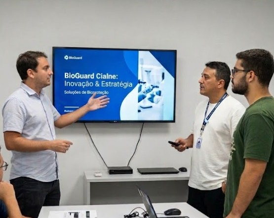

# 🐾 BioGuard — Sistema de Gestão de Fauna e Resgate Animal

**BioGuard** é uma plataforma Full Stack desenvolvida para a **Cialne** (empresa de avicultura, Fortaleza/CE) com o objetivo de monitorar e gerenciar ocorrências de animais (fauna silvestre ou domésticos) encontrados nas unidades da empresa. O sistema conecta colaboradores de campo a instituições de resgate (ONGs, CCZs e Abrigos) de forma ágil e rastreável.

> **Parceiro:** Cialne — Av. Presidente Costa e Silva, 2067, Fortaleza/CE  
> **Responsável:** Emanuel Carneiro | Gerente de TI | (85) 99147-6677  
> **ODS:** ODS 11 — Cidades e Comunidades Sustentáveis  
> **Versão:** v1.0.4 — Em operação local  

---

## 🚀 Funcionalidades Principais

- 🔐 **Autenticação Segura:** Login com cookie de sessão e proteção de rotas via Middleware
- 📊 **Dashboard Inteligente:** Painel com estatísticas em tempo real e gráficos de espécies (Recharts)
- 📝 **Registro de Ocorrências:** Formulário com captura de GPS, foto e descrição do animal
- 🗺️ **Mapa de Ocorrências:** Visualização geográfica dos registros via Leaflet
- 📂 **Diretório de Instituições:** Busca de parceiros com contato direto via WhatsApp
- 👤 **Perfil do Guardião:** Estatísticas individuais de cada colaborador
- 📱 **Interface Responsiva:** Adaptada para uso em smartphones em campo

---

## 🏗️ Visão Geral da Arquitetura

O BioGuard adota o padrão **MVC adaptado ao Next.js (App Router)**:

```
┌─────────────────────────────────────────────┐
│              CLIENTES                        │
│   Navegador Web / Smartphone (Mobile-First) │
└──────────────┬──────────────────────────────┘
               │ HTTP / Cookie de Sessão
┌──────────────▼──────────────────────────────┐
│           NEXT.JS (App Router)               │
│  ┌──────────────┐   ┌─────────────────────┐ │
│  │  React Pages │   │   API Routes        │ │
│  │  (View/UI)   │   │   (Controller)      │ │
│  └──────────────┘   └──────────┬──────────┘ │
└─────────────────────────────────┼────────────┘
                                  │ Prisma ORM
┌─────────────────────────────────▼────────────┐
│              PostgreSQL                       │
│   Tabelas: User, Institution, Occurrence     │
└──────────────────────────────────────────────┘
```

**Camadas:**
- **View:** Componentes React com Tailwind CSS e Recharts
- **Controller:** API Routes do Next.js (pasta `src/app/api/`)
- **Model:** Prisma ORM com schema tipado (`prisma/schema.prisma`)
- **Dados:** PostgreSQL hospedado localmente

> Ver diagrama completo em [`docs/architecture/architecture.md`](docs/architecture/architecture.md)

---

## 🔧 Como Executar o Projeto

### Pré-requisitos
- Node.js 18+
- PostgreSQL rodando localmente
- npm ou yarn

### Instalação

```bash
# 1. Clonar o repositório
git clone https://github.com/LeoRachits/Bioguard.git

# 2. Instalar dependências
npm install

# 3. Configurar variáveis de ambiente
cp .env.example .env
# Edite o .env com sua DATABASE_URL

# 4. Executar migrations e seed
npx prisma migrate deploy
npx prisma db seed

# 5. Iniciar o servidor de desenvolvimento
npm run dev
```

Acesse: [http://localhost:3000](http://localhost:3000)  
Login padrão: `admin@cialne.com.br` / `123`

---

## 📚 Documentação Técnica Completa

| Documento | Caminho |
|-----------|---------|
| Requisitos Funcionais e Não-Funcionais | [`docs/requirements/requirements.md`](docs/requirements/requirements.md) |
| Arquitetura e Decisões Técnicas | [`docs/architecture/architecture.md`](docs/architecture/architecture.md) |
| Modelo de Banco de Dados | [`docs/database/database_model.md`](docs/database/database_model.md) |
| Especificação das APIs | [`docs/api/api_documentation.md`](docs/api/api_documentation.md) |

---

## 🛠️ Tecnologias e Ferramentas

| Camada | Tecnologia | Versão |
|--------|-----------|--------|
| Framework Full Stack | Next.js (App Router) | 16.2.1 |
| Linguagem | JavaScript / TypeScript | ES6+ |
| Estilização | Tailwind CSS | 4.x |
| Gráficos | Recharts | 3.8.x |
| Mapa | Leaflet + React-Leaflet | 1.9.x |
| Ícones | Lucide React | 1.0.x |
| ORM | Prisma | 7.5.x |
| Banco de Dados | PostgreSQL | 15+ |
| Runtime | Node.js | 18+ |
| Versionamento | Git + GitHub | — |

---

## 📅 Cronograma — Etapa 2 (N708)

A Etapa 2 contempla o desenvolvimento completo e a integração de todas as funcionalidades planejadas. Prazo total: **14 semanas**.

| Fase | Semanas | Atividades | Entregável |
|------|---------|------------|------------|
| Fase 1 | Sem. 1–2 | Refatoração do ambiente, Docker, autenticação JWT real por perfil | Ambiente dockerizado, auth completa |
| Fase 2 | Sem. 2–3 | Implementação dos perfis de acesso (Colaborador, Gestor, ONG, Admin) com middleware | Controle de acesso por perfil funcional |
| Fase 3 | Sem. 3–5 | API completa de ocorrências com upload de foto e validações | Endpoints /ocorrencias completos com testes |
| Fase 4 | Sem. 5–6 | App Mobile (React Native) para registro em campo com GPS e câmera | App mobile funcional |
| Fase 5 | Sem. 6–8 | Acionamento automático de ONGs, notificações push (FCM) | Sistema de notificações funcional |
| Fase 6 | Sem. 8–9 | Chat em tempo real (WebSocket) entre colaborador e ONG | Chat funcional dentro da ocorrência |
| Fase 7 | Sem. 9–11 | Painéis Web completos: Gestor, Admin Master, ONG | Interfaces integradas à API |
| Fase 8 | Sem. 11–12 | Exportação de relatórios PDF/CSV com filtros | Relatórios mensais exportáveis |
| Fase 9 | Sem. 12–13 | Testes unitários (Jest), integração (Supertest) e E2E (Cypress) | Cobertura de testes > 70% |
| Fase 10 | Sem. 13–14 | Deploy em produção, CI/CD, ajustes com a Cialne e documentação final | Sistema em produção entregue à Cialne |

---

## 🌍 Relação com o ODS 11

O BioGuard contribui diretamente com o **ODS 11 — Cidades e Comunidades Sustentáveis** da Agenda 2030 da ONU:

- **Meta 11.6:** Reduzir o impacto ambiental negativo per capita das cidades — animais encontrados em ambiente industrial são encaminhados corretamente, sem soltura irregular
- **Meta 11.b:** Fomentar políticas integradas de gestão de risco — o sistema cria um protocolo rastreável entre empresa, ONGs e órgãos públicos (CCZ)
- **Responsabilidade Social Corporativa:** Relatórios exportáveis permitem à Cialne evidenciar suas ações ambientais à diretoria e a órgãos reguladores

---

## 🤝 Evidências da Prática Extensionista

**Reunião presencial com o parceiro:**
- **Data:** 15 de março de 2026
- **Local:** Cialne — Av. Presidente Costa e Silva, 2067, Fortaleza/CE
- **Participantes:** Sidney de Jesus F. de Freitas, Leandro G. Nascimento (equipe UNIFOR) + Emanuel Carneiro, Gerente de TI (Cialne)
- **Pauta:** Levantamento de requisitos, identificação do problema de animais errantes nas dependências e validação da proposta do BioGuard
- **Resultado:** Necessidades mapeadas, escopo validado, termo de parceria firmado



---

## 👥 Autores


| Leandro Gonçalves Nascimento | 2326350 | Back-end, integração com banco de dados, Prisma ORM, API Routes |
| Sidney de Jesus Felix de Freitas | 2323783 | Front-end, componentes React, design de interface, API de stats |


